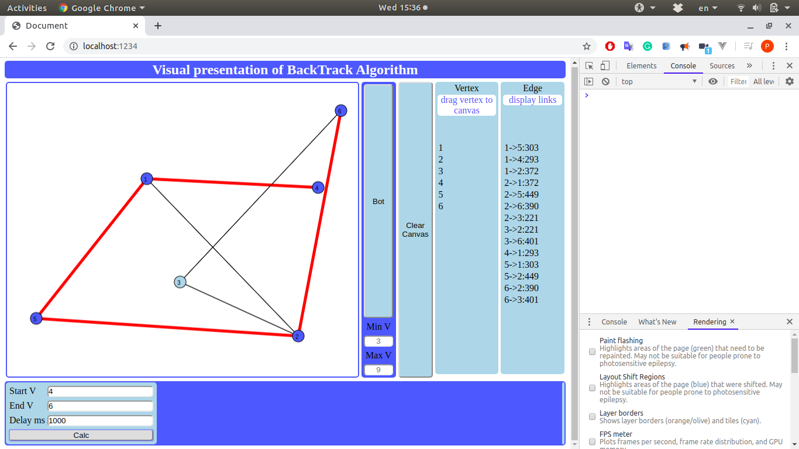

# Visualize BackTrack Algorithm  

## Instalation steps  

### Prerequests  

    0. Git
    1. NodeJs
    2. NPM
    3. Docker /not nesessery/

### Clone repository

    ```bash
    cd ~
    mkdir nodejs_projects
    cd nodejs_projects
    git clone https://github.com/petarnenovpetrov/vizbacktrack.git
    cd vizbacktrack
    npm install
    ```

### If you have installed Docker on local machine, just go

http://localhost:8080

OR

    ```bash
    npm run dev:serve
    ```

and go to

http://localhost:1234

## Usage  

### Fast demo:

    1. Click button "Bot";
    2. In form bellow add:
       1. number of start Vertex / 1 /
       2. number of end Vertex / N /
       3. dilay in ms / 500 /
       4. push "Calc"
    3. To restart click button "Clear Canvas"
    4. Step 1

### Manual step:  

    1. Drag&Drop "vertex" to canvas to create vertex
    2. Add min two vertexes
    3. Click in vertex circle and drag to another vertex circle to create edge
    4. Create as many as you want edges and vertexes.
    5. Goto to step 2 in Fast demo;

### Results  

    1. In bottom right corner will displays:
       1. Shortest path from start vertex to end vertex
       2. If salesman problem is resolved show path or undefined if not
       3. All possible combinations to reach end vertex from start vertex
       4. All combinations
    2. In canvas
       during the calculations 
       will show all current used vertexes in DODGERBLUE and edges in BOLD RED

 
 
  
