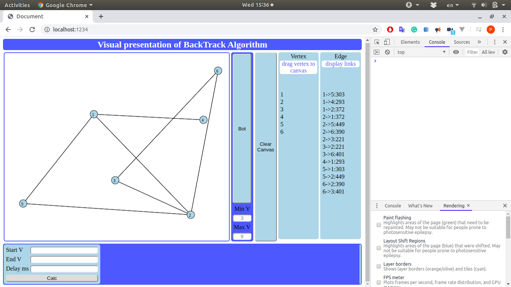

# Visualization BackTrack Algorithm  

## Installation steps  

### Prerequisites  

   [Git](https://git-scm.com/)  
   [NodeJS](https://nodejs.org/en/)  
   [Docker](https://www.docker.com/) **not necessary but recommended**  


### Clone repository

    ```bash
    cd ~
    mkdir nodejs_projects
    cd nodejs_projects
    git clone https://github.com/petarnenovpetrov/vizbacktrack.git
    cd vizbacktrack
    npm install

    ```

### If you have installed Docker on a local machine, just go

http://localhost:8080

OR

    ```bash
    npm run dev:serve

    ```

and go to

http://localhost:1234

## Usage  

### Fast demo with random vertexes from 3 to 9 and random edges between them  

    1. Click button "Bot";
    2. In form bottom left add:
       1. number of start Vertex / 1 /
       2. number of end Vertex / N /
       3. delay in ms / 500 /
       4. push "Calc"
    3. To clear all click button "Clear Canvas"
    4. Step 1
    5. To preset range of random vertexes
       1. Feel the fields minV and maxV
       2. By default minV = 3 and maxV = 9
    6. Step 1

### Manual step:  

    1. Drag&Drop "V" onto canvas to create a vertex / **look at 6** /
    2. Add min two vertexes
    3. Click in vertex circle and drag to another vertex circle to create an edge
    4. Create as many as you want edges and vertexes.
    5. Goto to step 2 in Fast demo;
    6. To stop sticking and follows mouse pointer by the vertex click mouseDown, move to empty area and mouseUp.

### Results  

    1. In bottom right corner will displays:
       1. The shortest path from the start vertex to end vertex
       2. If the salesman problem is resolved then will show the path or undefined if not
       3. All possible combinations to reach end vertex from the start vertex
       4. All combinations
    2. In canvas
       during the calculations 
       will show all currently used vertexes in DODGERBLUE and edges in BOLD RED
    3. Explanations:
       1. 1->2:345 , means vertex 1 is connected to vertex 2 and edge length is 345px
       2. cost:456 , means distance in pixels, 456px




  
